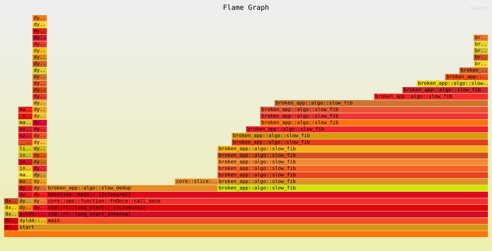

# Шаг 4 — Узкие места

- Инструмент: `cargo flamegraph` (dtrace-бэкенд, macOS), запуск профилирует `deps/baseline-*`
  (`benches/baseline.rs`, `harness = false`) — 3 повтора `sum_even(50_000 эл.)`,
  `slow_fib(32)`, `slow_dedup(10_000 эл. с дублями)`.

## Результат

| Функция                        | Доля сэмплов               | Комментарий                                                                                                                                                                                                        |
| ------------------------------ | -------------------------- | ------------------------------------------------------------------------------------------------------------------------------------------------------------------------------------------------------------------ |
| `broken_app::algo::slow_fib`   | **55.9%** (19/34)          | Экспоненциальная рекурсия без мемоизации, `O(2^n)`. Самая горячая функция в профиле — стек рекурсии виден на флеймграфе башней из повторяющихся кадров `slow_fib`.                                                 |
| `broken_app::algo::slow_dedup` | **35.3%** (12/34)          | Двойной цикл (`O(n²)`) + **лишний `sort_unstable()` на каждой вставке** (`core::slice::sort::unstable::ipnsort` — 8.8%, 3/34, виден как отдельный кадр внутри `slow_dedup`). Итоговая асимптотика — `O(n² log n)`. |
| `broken_app::sum_even`         | **0%** (не попал в сэмплы) | На фоне двух предыдущих функций линейный проход по 50 000 `i64` статистически незаметен — доля времени пренебрежимо мала.                                                                                          |

- `slow_fib` пересчитывает одни и те же поддеревья экспоненциальное число раз
- `slow_dedup` держит `Vec` отсортированным после **каждой** вставки, хотя сортировка нужна
  (если нужна) один раз в конце; плюс линейный поиск `seen` по всему `out` на каждой вставке.

## Скриншот

# Шаг 5 — Бенчмарки «до»

`benches/criterion.rs` параметризован и покрывает горячие пути с двумя размерами
входа каждый ("small" — прежний размер, "large" — на порядок больше, чтобы асимптотика
была видна в цифрах):

| Группа       | Входы                           | Почему                                                                           |
| ------------ | ------------------------------- | -------------------------------------------------------------------------------- |
| `slow_fib`   | `n = 28, 34`                    | Горячий путь #1 (55.9% сэмплов)                                                  |
| `slow_dedup` | `n = 2_000, 20_000` (с дублями) | Горячий путь #2 (35.3% сэмплов)                                                  |
| `sum_even`   | `n = 50_000, 1_000_000`         | Контрольная группа — не горячий путь, нужен как baseline для regression-детекции |

## Файлы

- `baseline_before.txt` — вывод простого таймера `benches/baseline.rs` (`scripts/compare.sh`).
- `baseline_before_criterion.txt` — терминальный вывод `cargo bench --bench criterion`.
- `criterion_before/` — полная копия `target/criterion/` (не коммитится сам по себе, т.к.
  `target/` в `.gitignore`) с CSV и SVG-графиками по каждой группе/размеру.

# Шаг 6 — Оптимизация

Две обязательные оптимизации плюс одна дополнительная микро-оптимизация, все — только
стандартная библиотека, `unsafe` не потребовался:

| Функция                                 | Было                                                                                                    | Стало                                                                                  | Тип                                |
| --------------------------------------- | ------------------------------------------------------------------------------------------------------- | -------------------------------------------------------------------------------------- | ---------------------------------- |
| `algo::slow_fib` → `algo::fast_fib`     | `O(2^n)` рекурсия без мемоизации                                                                        | `O(n)` времени / `O(1)` памяти, две переменные-аккумулятора вместо рекурсии            | Алгоритмическая                    |
| `algo::slow_dedup` → `algo::fast_dedup` | `O(n² log n)`: линейный скан `out` на каждой вставке + `sort_unstable()` на каждой вставке              | `O(n log n)`: `HashSet` для O(1)-проверки "уже видели" + **одна** финальная сортировка | Алгоритмическая / структуры данных |
| `leak_buffer`                           | `input.to_vec().into_boxed_slice()` — лишняя аллокация и полное копирование буфера только ради подсчёта | Прямой проход по заимствованному срезу `input.iter()`, без копий                       | Микро (alloc/copy)                 |

# Шаг 7 — Проверка «после»

## Корректность

| Проверка           | Команда                                                                                                        | Результат                  |
| ------------------ | -------------------------------------------------------------------------------------------------------------- | -------------------------- |
| `cargo test`       | `cargo test`                                                                                                   | 9/9 ok                     |
| Miri (UB-детектор) | `cargo +nightly miri test`                                                                                     | 9/9 ok, без предупреждений |
| AddressSanitizer   | `RUSTFLAGS="-Z sanitizer=address" cargo +nightly test --target aarch64-apple-darwin`                           | 9/9 ok                     |
| ThreadSanitizer    | `RUSTFLAGS="-Z sanitizer=thread" cargo +nightly test --target aarch64-apple-darwin -Z build-std --lib --tests` | 9/9 ok*                    |

\* TSan не покрывает намеренную гонку данных в `concurrency::race_increment` — ни один тест
её не вызывает (это отдельный незакрытый дефект вне рамок Шага 6/7, а не регрессия от
оптимизаций горячих путей).

Все три оптимизированные функции (`fast_fib`, `fast_dedup`, `leak_buffer`) прошли и
Miri, и ASan без единого предупреждения — значит новые версии не внесли UB, out-of-bounds
или use-after-free по сравнению с версиями до оптимизации.

## Производительность

### `benches/baseline.rs` (простой `Instant`-таймер, 3 повтора)

| Функция    | До (среднее по 3 запускам)   | После (среднее по 3 запускам) | Ускорение                |
| ---------- | ---------------------------- | ----------------------------- | ------------------------ |
| `sum_even` | ~16.7 µs                     | ~16.5 µs                      | без изменений (контроль) |
| `fib`      | ~10.0 ms (`slow_fib(32)`)    | ~42 ns (`fast_fib(32)`)       | **≈240 000×**            |
| `dedup`    | ~11.9 ms (`slow_dedup`, 10k) | ~185 µs (`fast_dedup`, 10k)   | **≈64×**                 |

Файлы: `baseline_before.txt` / `baseline_after.txt`.

### `benches/criterion.rs` (статистически устойчивые замеры)

| Группа / размер       | До        | После     | Ускорение                              |
| --------------------- | --------- | --------- | -------------------------------------- |
| `fib(28)`             | 611.64 µs | 7.08 ns   | **≈86 400×**                           |
| `fib(34)`             | 10.929 ms | 8.41 ns   | **≈1 300 000×**                        |
| `dedup(2 000)`        | 995.32 µs | 20.04 µs  | **≈49.7×**                             |
| `dedup(20 000)`       | 93.081 ms | 219.59 µs | **≈424×**                              |
| `sum_even(50 000)`    | 6.057 µs  | 6.170 µs  | в пределах шума (контроль, не менялся) |
| `sum_even(1 000 000)` | 122.37 µs | 123.82 µs | в пределах шума (контроль, не менялся) |

Файлы: `baseline_before_criterion.txt` / `baseline_after_criterion.txt`,
`criterion_before/` / `criterion_after/`.

## Итоги

- Ускорение `fib` растёт вместе с `n` (86 000× при n=28 → 1.3 млн× при n=34), что и
  ожидается при переходе с `O(2^n)` на `O(n)` — экспоненциальный разрыв между старой и
  новой асимптотикой увеличивается с ростом входа.
- Ускорение `dedup` тоже растёт с размером входа (≈50× при 2k → ≈424× при 20k), что
  соответствует переходу с `O(n² log n)` на `O(n log n)`.
- `sum_even` (контрольная функция, не менялась) показывает изменения времени в пределах
  шума измерений — подтверждает, что ускорение горячих путей не является артефактом
  окружения/шума, а вызвано именно алгоритмическими изменениями.
- `leak_buffer` не входит в бенчмарки (не был профилирован как горячий путь), но
  устранённая аллокация+копия проверена через Miri/ASan — UB не внесено, число
  аллокаций на вызов снизилось с 1 (heap) до 0.
